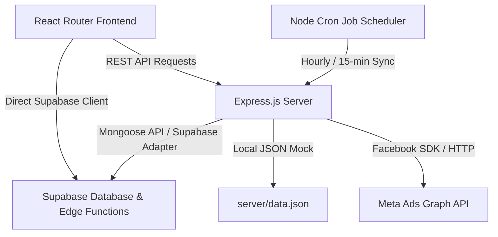

# System Architecture

This document describes the high-level architecture, software patterns, layers, entry points, and data flow of the TrafficPro system.

*Last Updated: 2026-06-10*

## System Overview

TrafficPro is structured as a decoupled Client-Server architecture with integrated Backend-as-a-Service (Supabase) helpers:



## Frontend Architecture

Located in the root project directory, the frontend behaves as a React Single-Page Application (SPA):

- **Routing Entry Point**: [src/main.jsx](file:///c:/Users/Administrator/Desktop/traffic-master-ai%20(1)/src/main.jsx) mounts [src/App.jsx](file:///c:/Users/Administrator/Desktop/traffic-master-ai%20(1)/src/App.jsx) which controls browser paths.
- **Layout Wrap**: [src/layout/MainLayout.jsx](file:///c:/Users/Administrator/Desktop/traffic-master-ai%20(1)/src/layout/MainLayout.jsx) wraps the main routes, incorporating the Sidebar, Header, and Page layout structure.
- **State Store**: [src/store/useStore.js](file:///c:/Users/Administrator/Desktop/traffic-master-ai%20(1)/src/store/useStore.js) holds persistent, serialized store modules (Leads, Campaigns, Products, Orders, WhatsApp conversations, and Integrations state).
- **Supabase Wrapper**: [src/lib/supabase.js](file:///c:/Users/Administrator/Desktop/traffic-master-ai%20(1)/src/lib/supabase.js) exposes the API client initialized with environment configurations.

## Backend Architecture

Located in the `server` directory, the backend acts as a Node.js Express service:

- **Entry Point**: [server/server.js](file:///c:/Users/Administrator/Desktop/traffic-master-ai%20(1)/server/server.js) initializes configuration variables, establishes middleware pipelines, loads routing modules, maps controllers, starts background job scheduling, and spins up the listening port.
- **Routes Layer**: Files in [server/routes/](file:///c:/Users/Administrator/Desktop/traffic-master-ai%20(1)/server/routes) associate Express verbs (GET, POST, etc.) with specific business controllers.
- **Controllers Layer**: Files in [server/controllers/](file:///c:/Users/Administrator/Desktop/traffic-master-ai%20(1)/server/controllers) process requests, validate arguments, call model managers or services, and structure JSON responses.
- **Adapter Model Layer**: [server/models/supabaseAdapter.js](file:///c:/Users/Administrator/Desktop/traffic-master-ai%20(1)/server/models/supabaseAdapter.js) maps class calls (`findOne`, `create`, `save`) into database-specific commands. Alternatively, [server/models/mockDb.js](file:///c:/Users/Administrator/Desktop/traffic-master-ai%20(1)/server/models/mockDb.js) acts as a local disk backup.
- **Services Layer**: Files in [server/services/](file:///c:/Users/Administrator/Desktop/traffic-master-ai%20(1)/server/services) contain integration-specific logic, such as SDK calls and HTTP adapters to Meta's Graph API.
- **Cron Job Layer**: [server/jobs/scheduler.js](file:///c:/Users/Administrator/Desktop/traffic-master-ai%20(1)/server/jobs/scheduler.js) leverages `node-cron` to execute scheduled operations (hourly metrics aggregation, 15-minute anomaly evaluations, automated publication rules, etc.).

## Key Data Flows

### 1. User Signin & Token Callback
```
User -> Browser -> Page: /login -> Supabase Auth -> Redirect /auth/callback -> Express API -> JWT Token Issued -> Local storage persistence
```

### 2. Meta Campaign Synchronization
```
Cron Job -> server/jobs/scheduler.js -> server/services/metaService.js -> Meta Graph API (Get Campaigns & Insights) -> DB Adapter -> Supabase SQL tables
```
